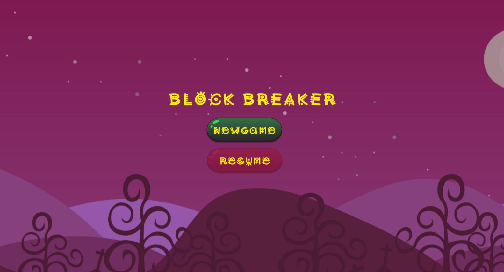
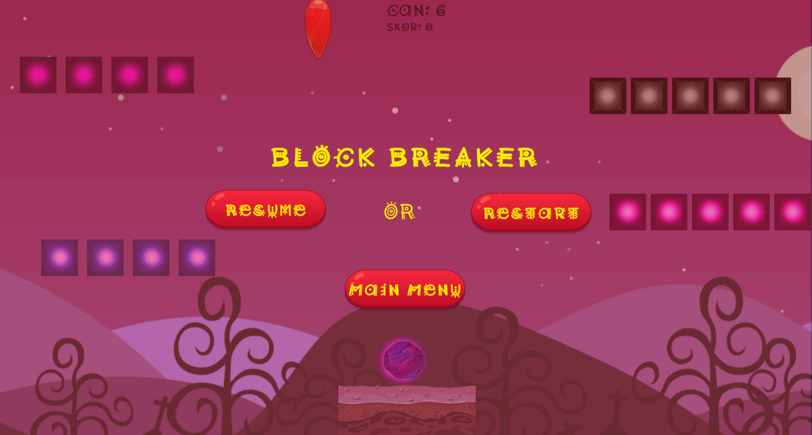
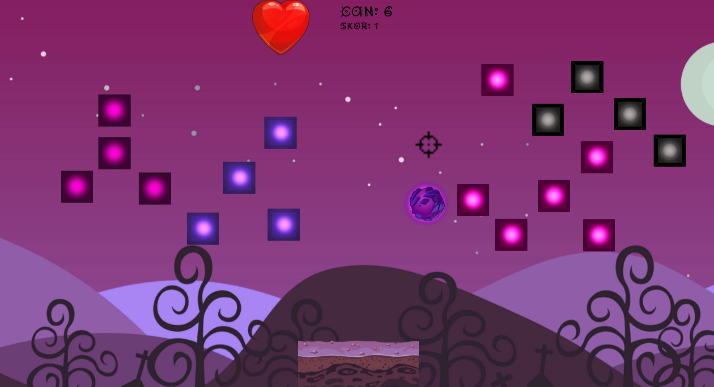
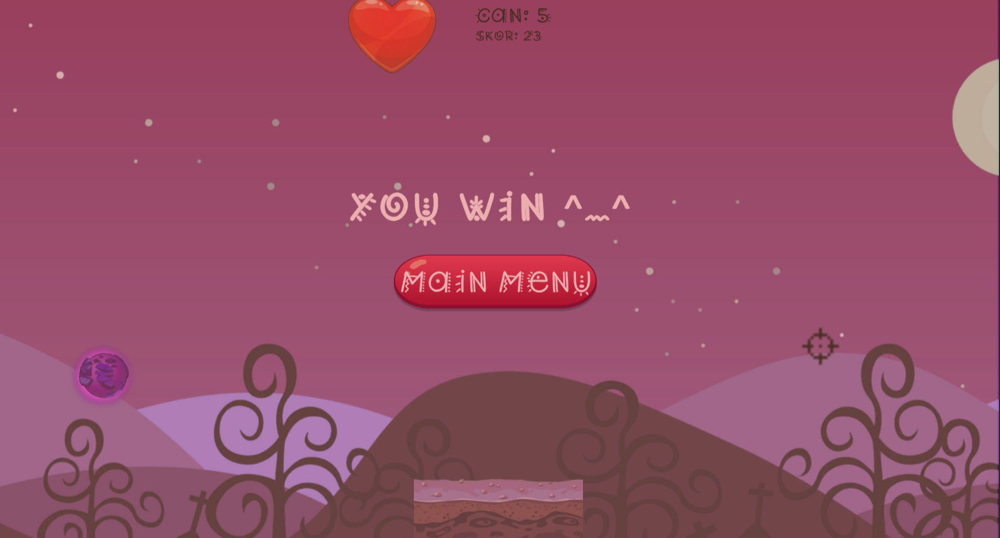
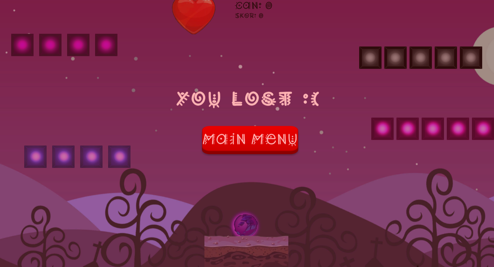

# 3. Sınıf Güz Dönemi Oyun Programlama Final Projem: BlowUpBox2

<h3 align="center" color="Darkblue">Ahmet Bahadır Aksakal - Çağla Yağmur İçer</h3>
<h4 align="center" color="Darkblue">20360859079</h4>
<h6 align="center" ><a href="https://bahadir-aksakal.itch.io/blowupboxx2" color="Purple">Oyunu Oynamak İçin Tıklayın(https://bahadir-aksakal.itch.io/blowupboxx2)</a></h6>

<ol>
  <li>
      <h3 color="Red">Projede Kullanılan Teknoloji Ve Diller:</h3>
      <ul>
        <li>Unity - C#</li>
      </ul>
  </li>
  <li>
      <h3 color="Red">Nasıl Oynanır:</h3>
      <ul>
        <li>Oyunun amacı, topu tüm karelere çarptırarak onları yok etmektir.</li>
        <li>Top zemine değerse 1 canınız gider. Toplam 6 canınız bulunmaktadır. Can 0 olduğunda oyunu kaybedersiniz, tüm kaydınız silinir ve oyun baştan başlar.</li>
        <li>Oyunun Pausemenü'sündeki Mainmenu butonuna bastığınız sahne save alınır. Daha sonra Mainmenüden resume butonuna tıklayarak o sahneden devam edersiniz.</li>
        <li>Sağ ve Sol yön tuşları ile playeri hareket ettirin. Sol mouse-click ile ateş edin.</li>
        <li>23 bloğu kırdığınızda 2. bölüme geçersiniz.</li>
        <li>2. bölüme geçildiğinde can haklarınız yenilenir ve skor sıfırlanır</li>
        <li>2. bölümdeki 23 bloğu kırdığınızda oyunu kazanırsınız.</li>
      </ul>
  </li>
  <li>
      <h3 color="Red">V2 Sürümü Geliştirme Notları:</h3>
      <ul>
         <li>Ahmet Bahadır Aksakal - Çağla Yağmur İçer</li>
         <li>Oyun için remote çalışmak pek sağlıklı olmayacağından, oyun geliştirme sürecinde ekip arkadaşımla birlikte tek bir bilgisayar üzerinden çalıştık</li>
         <li>Projedeki tüm scriptleri ve tasarımları birlikte yaptık.</li>
         <li>İllaki bir örnek vermek gerekirse:</li> 
         <ul>
           <h6>Çağla Yağmur İçer;</h6>
           <li> Pause menü fonksiyonlarının asenkron şekilde yazılması, eski butonların opitimize edilmesi, eski buton fonksiyonlarının asenkron olarak güncellenmesi</li>
           <li> Kayıt alma(Save), fonksiyonlarının yazılması ve projeye entegre edilmesi.</li>
           <li> Assetlerin Krita'da hazırlanması(Kendi Çizimleri) ve projeye entegre edilmesi.</li>
           <li> Animasyonların hazırlanması ve projeye entegre edilmesi.</li>
           <li> Müzik dosyalarının hazırlanması, editlenmesi ve projeye entegre edilmesi.</li>          
           <li> Yeni scriptlerin ve fonksiyonların geliştirilmesinde destek verilmesi.</li>
           <li> Sahne2'nin oluşturulması ve yeni bugların fixlemesi</li>
           <li> Tüm proje tek pc üzerinden yürütülüp aslında tüm adımlar beraber yapılmıştır.</li>
         </ul>
         <ul>
           <h6>Ahmet Bahadır Aksakal;</h6>
           <li> Ana menü scripti, bu scripteki asenkron geçişler, save edilen sahnenin tespiti ve yüklenmesi (resume butonu işlevi).</li>
           <li> Sahne2'nin oluşturulması ve yeni bugların fixlemesi</li>
           <li> Menü tasarımları ve oyuna uyumlu yeni yazı tipi eklenmesi ve projeye entegre edilmesi.</li>
           <li> Restart butonlarının en baştaki sahneye geri atıyordu,Butonlar o anda oynanan sahneyi restart edecek şekilde güncellendi(Asenkron).</li>
           <li> GoNextLevel() fonksiyonu ile istenilen şekilde asenkron sahne geçileri</li>
           <li> Tüm proje tek pc üzerinden yürütülüp aslında tüm adımlar beraber yapılmıştır.</li>
         </ul> 
    </ul>
  </li>
  <li>
      <h3 color="Red">V1 Sürümü Geliştirme Notları:</h3>
      <ul>
         <li>Ahmet Bahadır Aksakal - Çağla Yağmur İçer</li>
         <li>Oyun için remote çalışmak pek sağlıklı olmayacağından, oyun geliştirme sürecinde ekip arkadaşımla birlikte tek bir bilgisayar üzerinden çalıştık</li>
         <li>Projedeki tüm scriptleri ve tasarımları birlikte yaptık.</li>
         <li>İllaki bir örnek vermek gerekirse: Bahadır Aksakal; oyun pause kısmı, zamanın durması, pause menüsü, getAxis yapısı üzerinden biraz daha fazla   uğraşmıştır. Çağla Yağmur; top fiziği, nişangah, collision, box'lar ve rigidBody'ler üzerinde biraz daha fazla uğraşmıştır.  </li>         
    </ul>
  </li>
  <li>
      <h3 color="Red">Oyundan Görseller:</h3>
      <ul>
        <li></li>
        <li></li>
        <li></li>
        <li></li>
        <li></li>
        <li></li>        
      </ul>
  </li>
</ol>
