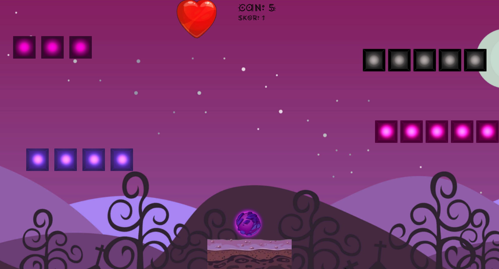

# Blow Up Box 2

### Ahmet Bahadır Aksakal - Çağla Yağmur İçer

#### 20360859079

****

- [EN : Description :book: :leftwards_arrow_with_hook:](#en)  
- [TR : Açıklama :book: :leftwards_arrow_with_hook:](#tr)

****

#### [EN]

# My 3rd Grade Fall Semester Game Programming Final Project: BlowUpBox2

###### [Click to Play the Game(https://bahadir-aksakal.itch.io/blowupboxx2)](https://bahadir-aksakal.itch.io/blowupboxx2)

1. ### Technology and Languages Used in the Project:
    
     * Unity - C#
      
2. ### How to Play:
    
     * The aim of the game is to destroy all the squares by hitting the ball into them.
     * If the ball touches the ground, you lose 1 life. You have a total of 6 lives. When health reaches 0, you lose the game, all your saves are deleted and the game starts from the beginning.
     * The scene where you press the Mainmenu button in the Pausemenu of the game is saved. You can then continue from that stage by clicking the resume button in the Mainmenu.
     * Move the player with the Right and Left arrow keys. Shoot with left mouse-click.
     * When you break 23 blocks, you move on to the 2nd chapter.
     *   2\. When you pass the chapter, your life rights are renewed and the score is reset.
     *   2\. You win the game when you break the 23 blocks in the level.
      
3. ### V2 Version Development Notes:
    
     * Ahmet Bahadır Aksakal - Çağla Yağmur İçer
     * Since it would not be healthy to work remotely for the game, my teammate and I worked on a single computer during the game development process.
     * We made all the scripts and designs in the project together.
     * To give just one example:
    
     ###### Çağla Yağmur İçer;
    
     * Writing pause menu functions asynchronously, optimizing old buttons, updating old button functions asynchronously
     * Writing save functions and integrating them into the project. Fixing new errors that occur
     * Preparation of assets in Krita (own drawings) and integration into the project.
     * Preparation of animations and integration into the project.
     * Preparing, editing and integrating music files into the project.
     * Providing support in the development of new scripts and functions.
     * Creating Stage2 and fixing new bugs
     * The entire project was carried out on a single PC and in fact all steps were done together.
    
     ###### Ahmet Bahadır Aksakal;
    
     * Main menu script, asynchronous transitions in this script, detection and loading of the saved scene (resume button function).
     * Creating Stage2 and fixing new bugs
     * Adding new fonts compatible with menu designs and the game and integrating them into the project.
     * Restart buttons were sending you back to the first scene. The buttons have been updated to restart the currently playing scene (Asynchronous).
     * Asynchronous scene transitions as desired with the GoNextLevel() function
     * The entire project was carried out on a single PC and in fact all steps were done together.
    
4. ### V1 Version Development Notes:
    
     * Ahmet Bahadır Aksakal - Çağla Yağmur İçer
     * Since it would not be healthy to work remotely for the game, my teammate and I worked on a single computer during the game development process.
     * We made all the scripts and designs in the project together.
     * To give an example: Bahadır Aksakal; The game has put a little more effort into the pause part, the stopping of time, the pause menu, and the getAxis structure. Cagla Yagmur; He worked a little more on gun physics, reticle, collision, boxes and rigidBodys.
      
5. ### Images from the Game:
    
     * 
     * 
     * 
     * 
     * 
     * 

****
****

#### [TR]

# 3. Sınıf Güz Dönemi Oyun Programlama Final Projem: BlowUpBox2

###### [Oyunu Oynamak İçin Tıklayın(https://bahadir-aksakal.itch.io/blowupboxx2)](https://bahadir-aksakal.itch.io/blowupboxx2)

1.  ### Projede Kullanılan Teknoloji Ve Diller:
    
    *   Unity - C#
      
2.  ### Nasıl Oynanır:
    
    *   Oyunun amacı, topu tüm karelere çarptırarak onları yok etmektir.
    *   Top zemine değerse 1 canınız gider. Toplam 6 canınız bulunmaktadır. Can 0 olduğunda oyunu kaybedersiniz, tüm kaydınız silinir ve oyun baştan başlar.
    *   Oyunun Pausemenü'sündeki Mainmenu butonuna bastığınız sahne save alınır. Daha sonra Mainmenüden resume butonuna tıklayarak o sahneden devam edersiniz.
    *   Sağ ve Sol yön tuşları ile playeri hareket ettirin. Sol mouse-click ile ateş edin.
    *   23 bloğu kırdığınızda 2. bölüme geçersiniz.
    *   2\. bölüme geçildiğinde can haklarınız yenilenir ve skor sıfırlanır
    *   2\. bölümdeki 23 bloğu kırdığınızda oyunu kazanırsınız.
      
3.  ### V2 Sürümü Geliştirme Notları:
    
    *   Ahmet Bahadır Aksakal - Çağla Yağmur İçer
    *   Oyun için remote çalışmak pek sağlıklı olmayacağından, oyun geliştirme sürecinde ekip arkadaşımla birlikte tek bir bilgisayar üzerinden çalıştık
    *   Projedeki tüm scriptleri ve tasarımları birlikte yaptık.
    *   İllaki bir örnek vermek gerekirse:
    
    ###### Çağla Yağmur İçer;
    
    *   Pause menü fonksiyonlarının asenkron şekilde yazılması, eski butonların opitimize edilmesi, eski buton fonksiyonlarının asenkron olarak güncellenmesi
    *   Kayıt alma(Save), fonksiyonlarının yazılması ve projeye entegre edilmesi. Oluşan yeni hataların fixlenmesi
    *   Assetlerin Krita'da hazırlanması(Kendi Çizimleri) ve projeye entegre edilmesi.
    *   Animasyonların hazırlanması ve projeye entegre edilmesi.
    *   Müzik dosyalarının hazırlanması, editlenmesi ve projeye entegre edilmesi.
    *   Yeni scriptlerin ve fonksiyonların geliştirilmesinde destek verilmesi.
    *   Sahne2'nin oluşturulması ve yeni bugların fixlemesi
    *   Tüm proje tek pc üzerinden yürütülüp aslında tüm adımlar beraber yapılmıştır.
    
    ###### Ahmet Bahadır Aksakal;
    
    *   Ana menü scripti, bu scripteki asenkron geçişler, save edilen sahnenin tespiti ve yüklenmesi (resume butonu işlevi).
    *   Sahne2'nin oluşturulması ve yeni bugların fixlemesi
    *   Menü tasarımları ve oyuna uyumlu yeni yazı tipi eklenmesi ve projeye entegre edilmesi.
    *   Restart butonlarının en baştaki sahneye geri atıyordu,Butonlar o anda oynanan sahneyi restart edecek şekilde güncellendi(Asenkron).
    *   GoNextLevel() fonksiyonu ile istenilen şekilde asenkron sahne geçileri
    *   Tüm proje tek pc üzerinden yürütülüp aslında tüm adımlar beraber yapılmıştır.
    
4.  ### V1 Sürümü Geliştirme Notları:
    
    *   Ahmet Bahadır Aksakal - Çağla Yağmur İçer
    *   Oyun için remote çalışmak pek sağlıklı olmayacağından, oyun geliştirme sürecinde ekip arkadaşımla birlikte tek bir bilgisayar üzerinden çalıştık
    *   Projedeki tüm scriptleri ve tasarımları birlikte yaptık.
    *   İllaki bir örnek vermek gerekirse: Bahadır Aksakal; oyun pause kısmı, zamanın durması, pause menüsü, getAxis yapısı üzerinden biraz daha fazla uğraşmıştır. Çağla Yağmur; top fiziği, nişangah, collision, box'lar ve rigidBody'ler üzerinde biraz daha fazla uğraşmıştır.
      
5.  ### Oyundan Görseller:
    
    *   
    *   
    *   
    *   
    *   
    *   
